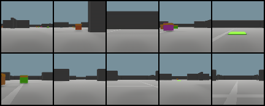

# Go to Goal based multi-agent environment

A multi-agent environment.
## The Rules
 - The task for every agent is to reach their respectively goal (which surprisingly matches the agent's color).
 - If an agent touches some other agent, they die (`-10`) and are respawned again into this eternal race to reach their goal.
 - If they do reach their goal, they are handed a fat sum of reward (`+5`) and are assigned the next goal (that's life I guess!😅).
 - Every agent is equipped with a camera (RGB/Depth) to observe their surroundings. The resolution by default is `128 x 128`
 - Other observations include (vector of size `8`):
   - Relative position of their goal
   - Their linear and angular velocities

## Flavours of the future:
Might include a scenario where the agents do not get the location of their goal, but instead receive the color of their goal.

## Acknowledgements
The depth sensor was implemented by using the code provided by Unity Technologies' [`ml-imagesynthesis`](https://bitbucket.org/Unity-Technologies/ml-imagesynthesis) repository.